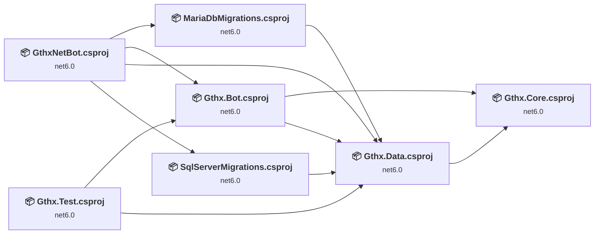
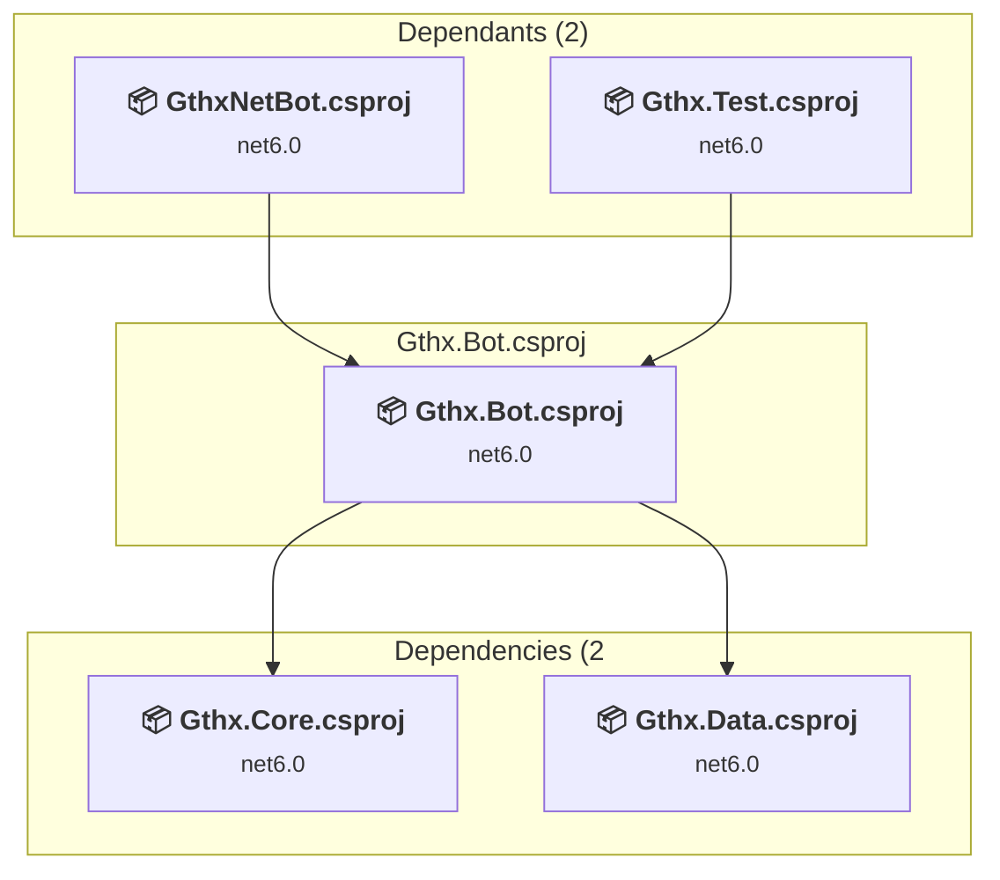
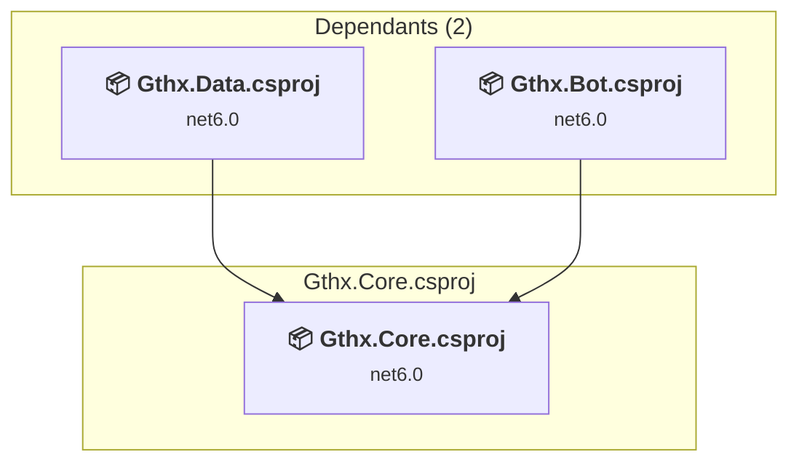
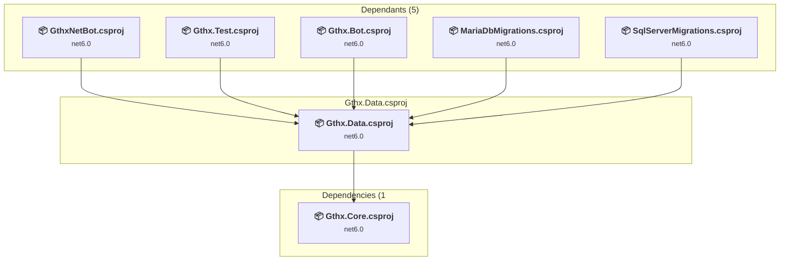
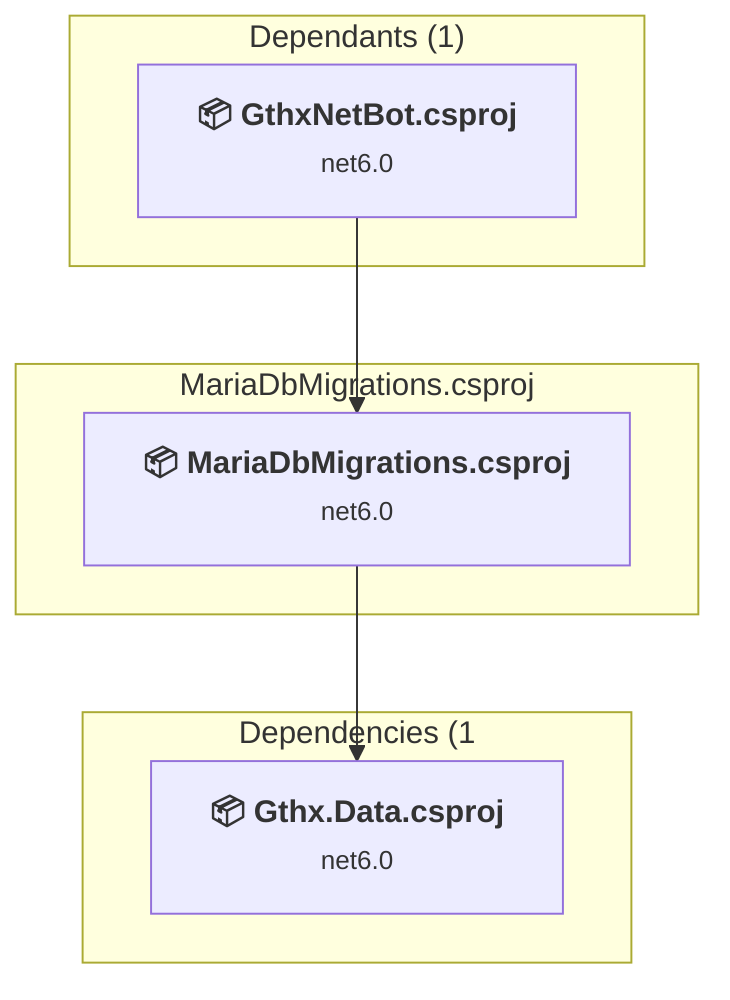
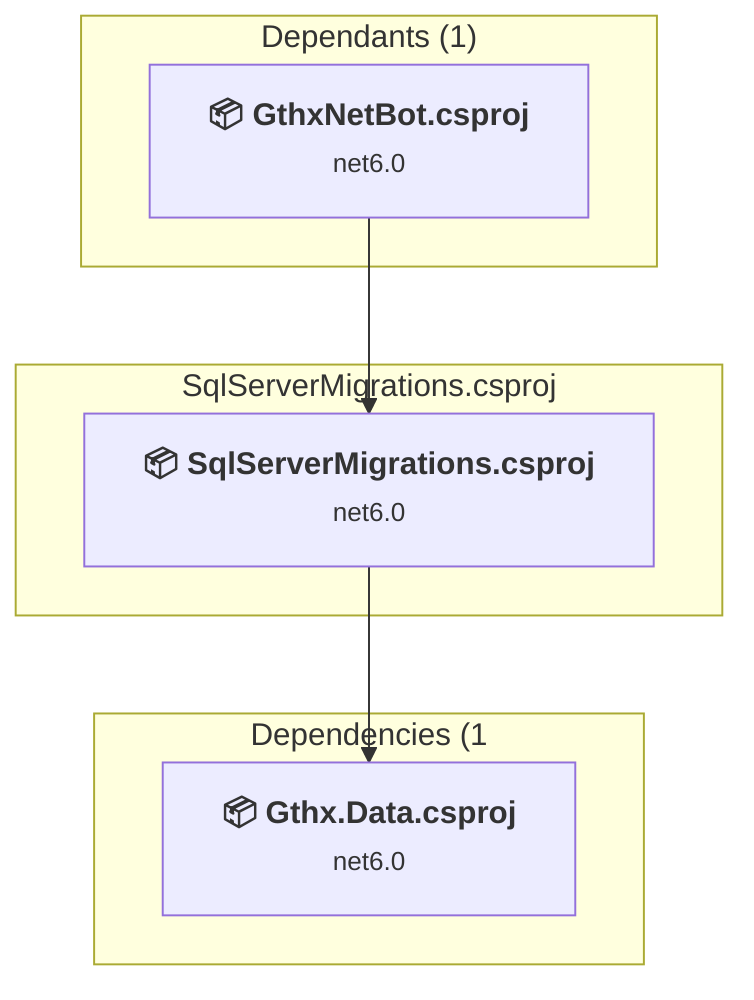
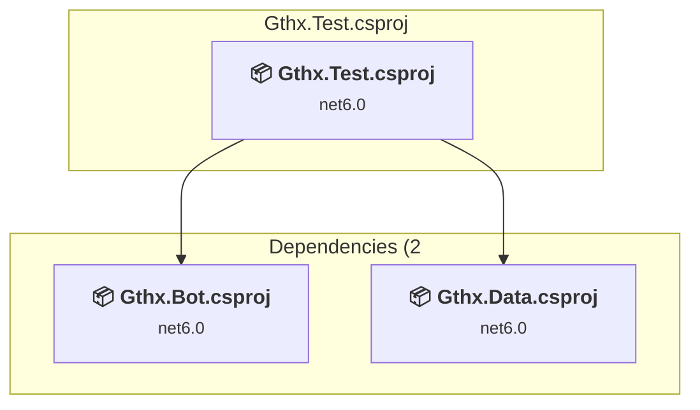
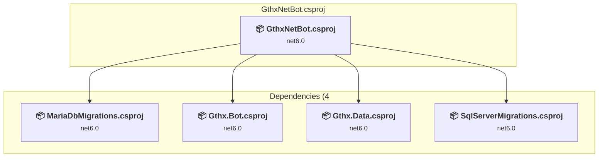

# Projects and dependencies analysis

This document provides a comprehensive overview of the projects and their dependencies in the context of upgrading to .NETCoreApp,Version=v10.0.

## Table of Contents

- [Executive Summary](#executive-Summary)
  - [Highlevel Metrics](#highlevel-metrics)
  - [Projects Compatibility](#projects-compatibility)
  - [Package Compatibility](#package-compatibility)
  - [API Compatibility](#api-compatibility)
- [Aggregate NuGet packages details](#aggregate-nuget-packages-details)
- [Top API Migration Challenges](#top-api-migration-challenges)
  - [Technologies and Features](#technologies-and-features)
  - [Most Frequent API Issues](#most-frequent-api-issues)
- [Projects Relationship Graph](#projects-relationship-graph)
- [Project Details](#project-details)

  - [Gthx.Bot\Gthx.Bot.csproj](#gthxbotgthxbotcsproj)
  - [Gthx.Data\Gthx.Core\Gthx.Core.csproj](#gthxdatagthxcoregthxcorecsproj)
  - [Gthx.Data\Gthx.Data\Gthx.Data.csproj](#gthxdatagthxdatagthxdatacsproj)
  - [Gthx.Data\MariaDbMigrations\MariaDbMigrations.csproj](#gthxdatamariadbmigrationsmariadbmigrationscsproj)
  - [Gthx.Data\SqlServerMigrations\SqlServerMigrations.csproj](#gthxdatasqlservermigrationssqlservermigrationscsproj)
  - [Gthx.Test\Gthx.Test.csproj](#gthxtestgthxtestcsproj)
  - [GthxNetBot\GthxNetBot.csproj](#gthxnetbotgthxnetbotcsproj)

## Executive Summary

### Highlevel Metrics

| Metric | Count | Status |
| :--- | :---: | :--- |
| Total Projects | 7 | All require upgrade |
| Total NuGet Packages | 26 | 13 need upgrade |
| Total Code Files | 57 |  |
| Total Code Files with Incidents | 11 |  |
| Total Lines of Code | 6496 |  |
| Total Number of Issues | 73 |  |
| Estimated LOC to modify | 36+ | at least 0.6% of codebase |

### Projects Compatibility

| Project | Target Framework | Difficulty | Package Issues | API Issues | Est. LOC Impact | Description |
| :--- | :---: | :---: | :---: | :---: | :---: | :--- |
| [Gthx.Bot\Gthx.Bot.csproj](#gthxbotgthxbotcsproj) | net6.0 | 🟢 Low | 2 | 0 |  | ClassLibrary, Sdk Style = True |
| [Gthx.Data\Gthx.Core\Gthx.Core.csproj](#gthxdatagthxcoregthxcorecsproj) | net6.0 | 🟢 Low | 0 | 0 |  | ClassLibrary, Sdk Style = True |
| [Gthx.Data\Gthx.Data\Gthx.Data.csproj](#gthxdatagthxdatagthxdatacsproj) | net6.0 | 🟢 Low | 7 | 0 |  | ClassLibrary, Sdk Style = True |
| [Gthx.Data\MariaDbMigrations\MariaDbMigrations.csproj](#gthxdatamariadbmigrationsmariadbmigrationscsproj) | net6.0 | 🟢 Low | 1 | 0 |  | ClassLibrary, Sdk Style = True |
| [Gthx.Data\SqlServerMigrations\SqlServerMigrations.csproj](#gthxdatasqlservermigrationssqlservermigrationscsproj) | net6.0 | 🟢 Low | 0 | 0 |  | ClassLibrary, Sdk Style = True |
| [Gthx.Test\Gthx.Test.csproj](#gthxtestgthxtestcsproj) | net6.0 | 🟢 Low | 3 | 36 | 36+ | DotNetCoreApp, Sdk Style = True |
| [GthxNetBot\GthxNetBot.csproj](#gthxnetbotgthxnetbotcsproj) | net6.0 | 🟢 Low | 17 | 0 |  | DotNetCoreApp, Sdk Style = True |

### Package Compatibility

| Status | Count | Percentage |
| :--- | :---: | :---: |
| ✅ Compatible | 13 | 50.0% |
| ⚠️ Incompatible | 1 | 3.8% |
| 🔄 Upgrade Recommended | 12 | 46.2% |
| ***Total NuGet Packages*** | ***26*** | ***100%*** |

### API Compatibility

| Category | Count | Impact |
| :--- | :---: | :--- |
| 🔴 Binary Incompatible | 0 | High - Require code changes |
| 🟡 Source Incompatible | 32 | Medium - Needs re-compilation and potential conflicting API error fixing |
| 🔵 Behavioral change | 4 | Low - Behavioral changes that may require testing at runtime |
| ✅ Compatible | 8615 |  |
| ***Total APIs Analyzed*** | ***8651*** |  |

## Aggregate NuGet packages details

| Package | Current Version | Suggested Version | Projects | Description |
| :--- | :---: | :---: | :--- | :--- |
| coverlet.collector | 3.0.3 |  | [Gthx.Test.csproj](#gthxtestgthxtestcsproj) | ✅Compatible |
| IrcDotNet | 0.7.0 |  | [GthxNetBot.csproj](#gthxnetbotgthxnetbotcsproj) | ✅Compatible |
| Microsoft.AspNetCore.TestHost | 5.0.7 | 10.0.5 | [Gthx.Test.csproj](#gthxtestgthxtestcsproj) | NuGet package upgrade is recommended |
| Microsoft.EntityFrameworkCore.Design | 5.0.7 | 10.0.5 | [GthxNetBot.csproj](#gthxnetbotgthxnetbotcsproj) | NuGet package upgrade is recommended |
| Microsoft.EntityFrameworkCore.SqlServer | 5.0.7 | 10.0.5 | [Gthx.Data.csproj](#gthxdatagthxdatagthxdatacsproj) | NuGet package upgrade is recommended |
| Microsoft.EntityFrameworkCore.Tools | 5.0.7 | 10.0.5 | [Gthx.Data.csproj](#gthxdatagthxdatagthxdatacsproj) | NuGet package upgrade is recommended |
| Microsoft.Extensions.Configuration | 5.0.0 | 10.0.5 | [GthxNetBot.csproj](#gthxnetbotgthxnetbotcsproj) | NuGet package upgrade is recommended |
| Microsoft.Extensions.Configuration.CommandLine | 5.0.0 | 10.0.5 | [GthxNetBot.csproj](#gthxnetbotgthxnetbotcsproj) | NuGet package upgrade is recommended |
| Microsoft.Extensions.Configuration.EnvironmentVariables | 5.0.0 | 10.0.5 | [GthxNetBot.csproj](#gthxnetbotgthxnetbotcsproj) | NuGet package upgrade is recommended |
| Microsoft.Extensions.Configuration.Json | 5.0.0 | 10.0.5 | [GthxNetBot.csproj](#gthxnetbotgthxnetbotcsproj) | NuGet package upgrade is recommended |
| Microsoft.Extensions.DependencyInjection | 5.0.1 | 10.0.5 | [GthxNetBot.csproj](#gthxnetbotgthxnetbotcsproj) | NuGet package upgrade is recommended |
| Microsoft.Extensions.Logging | 5.0.0 | 10.0.5 | [GthxNetBot.csproj](#gthxnetbotgthxnetbotcsproj) | NuGet package upgrade is recommended |
| Microsoft.Extensions.Logging.Console | 5.0.0 | 10.0.5 | [Gthx.Data.csproj](#gthxdatagthxdatagthxdatacsproj) [GthxNetBot.csproj](#gthxnetbotgthxnetbotcsproj) | NuGet package upgrade is recommended |
| Microsoft.NET.Test.Sdk | 16.10.0 |  | [Gthx.Test.csproj](#gthxtestgthxtestcsproj) | ✅Compatible |
| NUnit | 3.13.2 |  | [Gthx.Test.csproj](#gthxtestgthxtestcsproj) | ✅Compatible |
| NUnit3TestAdapter | 4.0.0 |  | [Gthx.Test.csproj](#gthxtestgthxtestcsproj) | ✅Compatible |
| Pomelo.EntityFrameworkCore.MySql | 5.0.0 |  | [Gthx.Data.csproj](#gthxdatagthxdatagthxdatacsproj) [Gthx.Test.csproj](#gthxtestgthxtestcsproj) [GthxNetBot.csproj](#gthxnetbotgthxnetbotcsproj) [MariaDbMigrations.csproj](#gthxdatamariadbmigrationsmariadbmigrationscsproj) | ⚠️NuGet package is deprecated |
| Serilog | 2.10.0 |  | [Gthx.Test.csproj](#gthxtestgthxtestcsproj) [GthxNetBot.csproj](#gthxnetbotgthxnetbotcsproj) | ✅Compatible |
| Serilog.AspNetCore | 4.1.0 |  | [Gthx.Test.csproj](#gthxtestgthxtestcsproj) [GthxNetBot.csproj](#gthxnetbotgthxnetbotcsproj) | ✅Compatible |
| Serilog.Extensions.Logging | 3.0.1 |  | [Gthx.Bot.csproj](#gthxbotgthxbotcsproj) [Gthx.Test.csproj](#gthxtestgthxtestcsproj) | ✅Compatible |
| Serilog.Settings.Configuration | 3.1.0 |  | [Gthx.Test.csproj](#gthxtestgthxtestcsproj) [GthxNetBot.csproj](#gthxnetbotgthxnetbotcsproj) | ✅Compatible |
| Serilog.Sinks.Console | 3.1.1 |  | [Gthx.Test.csproj](#gthxtestgthxtestcsproj) | ✅Compatible |
| Serilog.Sinks.Email | 2.4.0 |  | [GthxNetBot.csproj](#gthxnetbotgthxnetbotcsproj) | ✅Compatible |
| Serilog.Sinks.File | 4.1.0 |  | [Gthx.Test.csproj](#gthxtestgthxtestcsproj) [GthxNetBot.csproj](#gthxnetbotgthxnetbotcsproj) | ✅Compatible |
| Serilog.Sinks.Seq | 5.0.1 |  | [Gthx.Test.csproj](#gthxtestgthxtestcsproj) [GthxNetBot.csproj](#gthxnetbotgthxnetbotcsproj) | ✅Compatible |
| System.Threading.Tasks.Dataflow | 5.0.0 | 10.0.5 | [Gthx.Bot.csproj](#gthxbotgthxbotcsproj) | NuGet package upgrade is recommended |

## Top API Migration Challenges

### Technologies and Features

| Technology | Issues | Percentage | Migration Path |
| :--- | :---: | :---: | :--- |

### Most Frequent API Issues

| API | Count | Percentage | Category |
| :--- | :---: | :---: | :--- |
| T:Microsoft.AspNetCore.Hosting.IWebHost | 24 | 66.7% | Source Incompatible |
| T:Microsoft.AspNetCore.Hosting.WebHostBuilder | 8 | 22.2% | Source Incompatible |
| M:Microsoft.Extensions.Logging.ConsoleLoggerExtensions.AddConsole(Microsoft.Extensions.Logging.ILoggingBuilder) | 4 | 11.1% | Behavioral Change |

## Projects Relationship Graph

Legend:
📦 SDK-style project
⚙️ Classic project

## Project Details

### Gthx.Bot\Gthx.Bot.csproj

#### Project Info

- **Current Target Framework:** net6.0
- **Proposed Target Framework:** net10.0
- **SDK-style**: True
- **Project Kind:** ClassLibrary
- **Dependencies**: 2
- **Dependants**: 2
- **Number of Files**: 22
- **Number of Files with Incidents**: 1
- **Lines of Code**: 1373
- **Estimated LOC to modify**: 0+ (at least 0.0% of the project)

#### Dependency Graph

Legend:
📦 SDK-style project
⚙️ Classic project

### API Compatibility

| Category | Count | Impact |
| :--- | :---: | :--- |
| 🔴 Binary Incompatible | 0 | High - Require code changes |
| 🟡 Source Incompatible | 0 | Medium - Needs re-compilation and potential conflicting API error fixing |
| 🔵 Behavioral change | 0 | Low - Behavioral changes that may require testing at runtime |
| ✅ Compatible | 1139 |  |
| ***Total APIs Analyzed*** | ***1139*** |  |

### Gthx.Data\Gthx.Core\Gthx.Core.csproj

#### Project Info

- **Current Target Framework:** net6.0
- **Proposed Target Framework:** net10.0
- **SDK-style**: True
- **Project Kind:** ClassLibrary
- **Dependencies**: 0
- **Dependants**: 2
- **Number of Files**: 7
- **Number of Files with Incidents**: 1
- **Lines of Code**: 117
- **Estimated LOC to modify**: 0+ (at least 0.0% of the project)

#### Dependency Graph

Legend:
📦 SDK-style project
⚙️ Classic project

### API Compatibility

| Category | Count | Impact |
| :--- | :---: | :--- |
| 🔴 Binary Incompatible | 0 | High - Require code changes |
| 🟡 Source Incompatible | 0 | Medium - Needs re-compilation and potential conflicting API error fixing |
| 🔵 Behavioral change | 0 | Low - Behavioral changes that may require testing at runtime |
| ✅ Compatible | 172 |  |
| ***Total APIs Analyzed*** | ***172*** |  |

### Gthx.Data\Gthx.Data\Gthx.Data.csproj

#### Project Info

- **Current Target Framework:** net6.0
- **Proposed Target Framework:** net10.0
- **SDK-style**: True
- **Project Kind:** ClassLibrary
- **Dependencies**: 1
- **Dependants**: 5
- **Number of Files**: 4
- **Number of Files with Incidents**: 1
- **Lines of Code**: 413
- **Estimated LOC to modify**: 0+ (at least 0.0% of the project)

#### Dependency Graph

Legend:
📦 SDK-style project
⚙️ Classic project

### API Compatibility

| Category | Count | Impact |
| :--- | :---: | :--- |
| 🔴 Binary Incompatible | 0 | High - Require code changes |
| 🟡 Source Incompatible | 0 | Medium - Needs re-compilation and potential conflicting API error fixing |
| 🔵 Behavioral change | 0 | Low - Behavioral changes that may require testing at runtime |
| ✅ Compatible | 421 |  |
| ***Total APIs Analyzed*** | ***421*** |  |

### Gthx.Data\MariaDbMigrations\MariaDbMigrations.csproj

#### Project Info

- **Current Target Framework:** net6.0
- **Proposed Target Framework:** net10.0
- **SDK-style**: True
- **Project Kind:** ClassLibrary
- **Dependencies**: 1
- **Dependants**: 1
- **Number of Files**: 5
- **Number of Files with Incidents**: 1
- **Lines of Code**: 884
- **Estimated LOC to modify**: 0+ (at least 0.0% of the project)

#### Dependency Graph

Legend:
📦 SDK-style project
⚙️ Classic project

### API Compatibility

| Category | Count | Impact |
| :--- | :---: | :--- |
| 🔴 Binary Incompatible | 0 | High - Require code changes |
| 🟡 Source Incompatible | 0 | Medium - Needs re-compilation and potential conflicting API error fixing |
| 🔵 Behavioral change | 0 | Low - Behavioral changes that may require testing at runtime |
| ✅ Compatible | 1097 |  |
| ***Total APIs Analyzed*** | ***1097*** |  |

### Gthx.Data\SqlServerMigrations\SqlServerMigrations.csproj

#### Project Info

- **Current Target Framework:** net6.0
- **Proposed Target Framework:** net10.0
- **SDK-style**: True
- **Project Kind:** ClassLibrary
- **Dependencies**: 1
- **Dependants**: 1
- **Number of Files**: 5
- **Number of Files with Incidents**: 1
- **Lines of Code**: 939
- **Estimated LOC to modify**: 0+ (at least 0.0% of the project)

#### Dependency Graph

Legend:
📦 SDK-style project
⚙️ Classic project

### API Compatibility

| Category | Count | Impact |
| :--- | :---: | :--- |
| 🔴 Binary Incompatible | 0 | High - Require code changes |
| 🟡 Source Incompatible | 0 | Medium - Needs re-compilation and potential conflicting API error fixing |
| 🔵 Behavioral change | 0 | Low - Behavioral changes that may require testing at runtime |
| ✅ Compatible | 1114 |  |
| ***Total APIs Analyzed*** | ***1114*** |  |

### Gthx.Test\Gthx.Test.csproj

#### Project Info

- **Current Target Framework:** net6.0
- **Proposed Target Framework:** net10.0
- **SDK-style**: True
- **Project Kind:** DotNetCoreApp
- **Dependencies**: 2
- **Dependants**: 0
- **Number of Files**: 10
- **Number of Files with Incidents**: 5
- **Lines of Code**: 1896
- **Estimated LOC to modify**: 36+ (at least 1.9% of the project)

#### Dependency Graph

Legend:
📦 SDK-style project
⚙️ Classic project

### API Compatibility

| Category | Count | Impact |
| :--- | :---: | :--- |
| 🔴 Binary Incompatible | 0 | High - Require code changes |
| 🟡 Source Incompatible | 32 | Medium - Needs re-compilation and potential conflicting API error fixing |
| 🔵 Behavioral change | 4 | Low - Behavioral changes that may require testing at runtime |
| ✅ Compatible | 3393 |  |
| ***Total APIs Analyzed*** | ***3429*** |  |

### GthxNetBot\GthxNetBot.csproj

#### Project Info

- **Current Target Framework:** net6.0
- **Proposed Target Framework:** net10.0
- **SDK-style**: True
- **Project Kind:** DotNetCoreApp
- **Dependencies**: 4
- **Dependants**: 0
- **Number of Files**: 7
- **Number of Files with Incidents**: 1
- **Lines of Code**: 874
- **Estimated LOC to modify**: 0+ (at least 0.0% of the project)

#### Dependency Graph

Legend:
📦 SDK-style project
⚙️ Classic project

### API Compatibility

| Category | Count | Impact |
| :--- | :---: | :--- |
| 🔴 Binary Incompatible | 0 | High - Require code changes |
| 🟡 Source Incompatible | 0 | Medium - Needs re-compilation and potential conflicting API error fixing |
| 🔵 Behavioral change | 0 | Low - Behavioral changes that may require testing at runtime |
| ✅ Compatible | 1279 |  |
| ***Total APIs Analyzed*** | ***1279*** |  |

